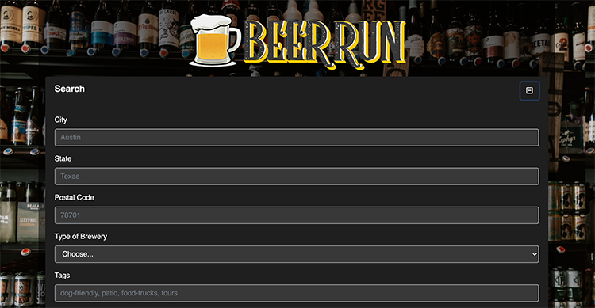

## Beer Run

Link to live project ['https://vivgarcia.github.io/Group-11-Project/']

## Description

Beer Run is an application that takes in user input and will return breweries and their Yelp ratings.

## How to use

Enter your desired city and state, select type of brewery and hit search. Beer Run will return
breweries local to the data you have entered, along with their Yelp reviews. 

## Meet the team

This project was a collaborative effort with a front-end and back-end team. 

* **Viviana Garcia - Project Manager, Front-End**
* **Cole DeRosiers - Front-End @dcoleslaw86**
* **Eduardo Ozuna - Back-End @eozuna3**
* **Britney Ross - Back-End @britneyross**

This project was built using:
* HTML
* CSS & SASS
* Bootstrap
* Font Awesome
* Google Fonts
* JavaScript
    * jQuery
    * AJAX
* Open Brewery API
* Yelp API

## Future Development:
* Add an age verification feature
* Incorporate a Google Maps API
* Use more up-to-date brewery API
